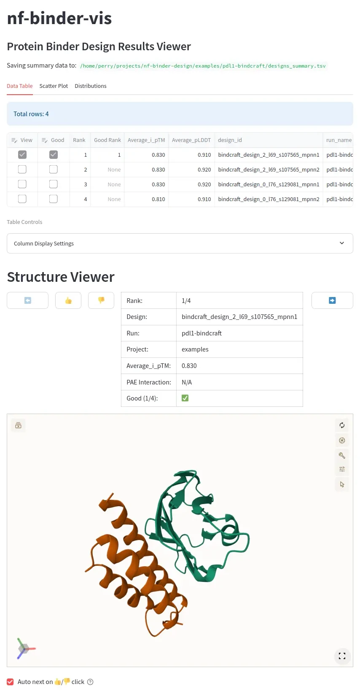

# nf-binder-vis

Results visualization for the [nf-binder-design](https://github.com/Australian-Protein-Design-Initiative/nf-binder-design) workflow.



## Features

- **Automatic Run Detection**: Automatically detects and parses run folders from `nf-binder-design` (RFdiffusion binder design and BindCraft workflows) and 'vanilla' BindCraft runs
- **Interactive Visualization**: Scatter plots, distributions, and structure viewer with Molstar
- **Simple design triage**: Mark designs as "good" with thumbs up/down and save selections to `designs_summary.tsv`
- **Multi-Run Support**: View results from single runs or multiple runs in one interface

## Overview

This tool is designed to streamline manual screening of top scoring protein binder designs generated by `nf-binder-design` or BindCraft. The high level steps are:

- Run `nf-binder-design` or BindCraft to generate high scoring designs 
  - _(you'll need the PDBs and `combined_scores.tsv` or `final_design_stats.csv` in the folder structure these pipelines output)_
- Run `app.py` to visualize and manually select the top scoring designs based on your own criteria.
- Generate sequences to order for gene synthesis of the 'good' designs - see [`scripts/binder_prep`](scripts/binder_prep/README.md).

## Installation

This project uses `uv` for Python package management and virtual environment handling.

### Quickstart

Clone the Repository:

```bash
git clone https://github.com/Australian-Protein-Design-Initiative/nf-binder-vis.git
cd nf-binder-vis
```

Run using `uv`:

```bash
# Install uv, if you don't have it
# curl -LsSf https://astral.sh/uv/install.sh | sh
# export PATH=~/.local/bin:${PATH}

# Run with uv (recommended)
uv run streamlit run app.py -- --path /path/to/results
```

The app will automatically detect and displays results from `nf-binder-design` runs for both BindCraft and RFdiffusion workflows. By default, it will be available at http://localhost:8501/.

## Building a Docker/Apptainer Image

```bash
docker build -t nf-binder-vis:latest .
apptainer build nf-binder-vis_latest.sif docker-daemon://nf-binder-vis:latest
```

### Running with Apptainer

```bash
apptainer run nf-binder-vis_latest.sif --server.port 8502 -- --path /path/to/results
```
> The `--server.port` flag can be used to change the default port. Note the bare `--` before the `--path` flag - this is not a typo.

Open http://localhost:8502/

### Running with Docker

```bash
docker run -it --rm -v /abs/path/to/results:/results nf-binder-vis:latest -- --path /results
```

Open http://localhost:8501/


## TODO

- Look at https://github.com/PDBeurope/pdb-images#pdbimages - can we pre-render a galley of images for each pdb file?

